目标： 游戏辅助工具

1. 展现图像立体结构
2. 发现可行解
3. 计算最优路径

Logic

1. 信息采集
2. 信息展示
3. 可行解计算

思路

1. 图片 → 创建分层模型
2. 实时数据录入，实例化模型
3. 计算可行解，模型计算
4. 模型视觉展示

架构愿景

1. Item 一个元素，8*8
   type：元素类型，
   location：屏幕坐标位置（x，y）
   size：大小 固定
   rank：堆叠高度
2. Layer： 有结构的一层 item
3. Block：独立的堆叠 Layer，
   visibleItems： 可见元素
   faceItems： 表面元素

4. panel:  (8 * 8) * 8 * 7  
   

TASK
1. 页面展现堆栈
   1. 定义卡片
   2. 

